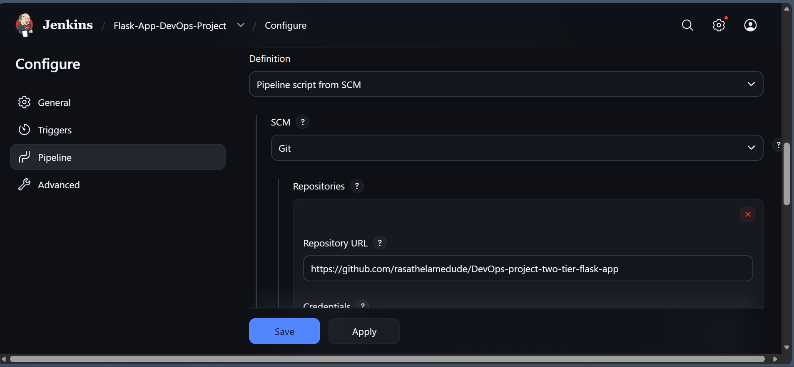

# Two-Tier Flask Application with CI/CD Pipeline


## Table of Contents

- [Overview](#overview)
- [Architecture](#architecture)
- [Features](#features)
- [Technologies Used](#technologies-used)
- [Project Structure](#project-structure)
- [Local Setup](#local-setup)
- [AWS Deployment Guide](#aws-deployment-guide)
- [CI/CD Pipeline](#cicd-pipeline)
- [Screenshots](#screenshots)
- [Challenges & Learnings](#challenges--learnings)
- [Key Takeaways](#key-takeaways)
- [Future Improvements](#future-improvements)
- [Security Notes](#security-notes)
- [License](#license)
- [Acknowledgments](#acknowledgments)

## Overview

A two-tier web application built with Flask and MySQL, demonstrating a complete CI/CD pipeline using Jenkins, Docker, and AWS EC2. This project showcases automated deployment workflows, containerization, and cloud infrastructure management.

## Architecture

```
┌─────────────┐      ┌──────────────────┐        ┌─────────────────────┐
│  Developer  │─────▶│  GitHub Repository│─────▶│   Jenkins Server    │
│ (Git Push)  │      │  (Source Control) │       │   (AWS EC2)         │
└─────────────┘      └──────────────────┘        │                     │
                                                 │ 1. Clone Repository │
                                                 │ 2. Build Docker     │
                                                 │ 3. Deploy Containers│
                                                 └──────────┬──────────┘
                                                            │
                                                            ▼
                                                  ┌─────────────────────┐
                                                  │  Application Server │
                                                  │    (Same EC2)       │
                                                  │                     │
                                                  │  ┌───────────────┐  │
                                                  │  │ Flask Container│ │
                                                  │  └───────┬───────┘  │
                                                  │          │          │
                                                  │          ▼          │
                                                  │  ┌───────────────┐  │
                                                  │  │ MySQL Container│ │
                                                  │  └───────────────┘  │
                                                  └─────────────────────┘
```

## Features

- **Full CI/CD Pipeline** - Automated build and deployment on every git push
- **Containerized Deployment** - Both Flask and MySQL run in isolated Docker containers
- **Automated Database Setup** - MySQL initializes with proper schema on first run
- **Helth Checks** - Both services include health monitoring
- **Persistent Data** - MySQL data persists across container restarts using docker Docker volumes
- **Custom Networking** - Containers communicate on isolated Docker network

## Technologies used

- **Python 3.9** - Application runtime
- **Flask 3.0** - Web framework
- **MySQL** - Relational database
- **Flask-MySQLdb** - Database connector

### DevOps & Infrastructure

- **Docker** - Containerization
- **Docker Compose** - Multi-container orchestration
- **AWS EC2** - Cloud hosting (Amazon Linux 2023)
- **Git/GitHub** - Version control

## Project structure

```
├── app.py                  # Flask application
├── templates/
│   └── index.html         # Frontend template
├── requirements.txt       # Python dependencies
├── Dockerfile            # Flask container definition
├── docker-compose.yml    # Multi-container orchestration
├── Jenkinsfile          # CI/CD pipeline definition
└── README.md            # Project documentation
```

## Local Setup

### Running Locally with Docker Compose

1. **Clone the repository**

```bash
git clone https://github.com/rasathelamedude/DevOps-project-two-tier-flask-app.git
cd DevOps-project-two-tier-flask-app
```

2. **Build and run with Docker Compose**

```bash
docker compose up -d
```

3. **Access the application**

```
http://localhost:8000
```

4. **Stop the application**

```bash
docker compose down
```

## AWS Deployment Guide

### Step 1: Launch Ec2 Instance

1. Launche an **Amazon Linux 2023** EC2 instance (t2.small or larger recommended)
2. Configure Security Group with the following inbound rules:
   - SSH (Port 22) - Your IP
   - HTTP (Port 80) - Anywhere
   - Custom TCP (Port 8000) - Anywhere (Flask app)
   - Custom TCP (Port 8080) - Anywhere (Jenkins)

### Step 2: Install Dependencies on EC2

SSH into your instance and run:

```bash
# Update system
sudo yum update -y

# Install Git
sudo yum install git -y

# Install Docker and set up docker
sudo yum install docker -y
sudo systemctl start docker
sudo systemctl enable docker
sudo usermod -aG docker ec2-user
newgrp docker

# Install Docker Compose
sudo mkdir -p /usr/local/lib/docker/cli-plugins
sudo curl -SL  https://github.com/docker/compose/releases/latest/download/docker-compose-linux-x86_64 -o /usr/local/lib/docker/cli-plugins/docker-compose
sdo chmod +x /usr/local/lib/docker/cli-plugins/docker-compose

# Verify
docker --version
docker compose version
```

### Step 3: Install Jenkins

```bash
# Install Java as Jenkins is written in Java and runs on the JVM
sudo yum install java-17-amazon-corretto -y

# Add jenkins repository
sudo wget -O /etc/yum.repos.d/jenkins.repo https://pkg.jenkins.io/redhat-stable/jenkins.repo
sudo rpm --import https://pkg.jenkins.io/redhat-stable/jenkins.io-2023.key

# install jenkins
sudo yum install jenkins -y

# Start Jenkins
sudo systemctl start jenkins
sudo systemctl enable jenkins

# Grant jenkins docker permissions
sudo usermod -aG docker jenkins
sudo systemctl restart jenkins

# Get initial admin password
sudo cat /var/lib/jenkins/secrets/initialAdminPassword
```

### Step 4: Configure Jenkins

1. Access Jenkins at `http://<your-ec2-public-ip>:8080`
2. Enter the initial admin password
3. Install suggested plugins
4. Create admin user

### Step 5: Create Jenkins Pipeline

1. Create new **Pipeline** job in Jenkins
2. Configure:
   - **Definition**: Pipeline script from SCM
   - **SCM**: Git
   - **Repository URL**: Your GitHub repo URL
   - **Script Path**: Jenkinsfile
3. Save and click **Build now**

### Step 6: Increase /tmp Size (crucial)

Jenkins requires sufficient temporary workspace:

```bash
# Increase tmpfs to 2GB
sudo mount -o remount,size=2G /tmp

# Make it permanent
echo "tmpfs /tmp tmpfs defaults,size=2G 0 0" | sudo tee -a /etc/fstab
```

### Step 7: Access Your Application

After successful pipeline execution:

```
http://<your-ec2-public-ip>:8000
```

## CI/CD Pipeline

The Jenkins Pipeline automates three key stages:

### Stage 1: Clone Code

- Pulls the latest code from the GitHub respository
- Triggered automatically on git push (can also be configured with webhooks)

### Stage 2: Build Docker Image

- Builds the Flask application docker image
- Tags it as `flask-app:latest`
- Leverages Docker layer caching for faster builds

### Stage 3: Deploy with Docker Compose

- Stops any existing containers from previous deployment
- Start fresh containers using the newly built image
- MySQL container initializes with persistnet volume
- Flask container connects to MySQL on custom network

**Pipeline Flow:**

```
Git Push → Jenkins Detects Change → Clone Repo → Build Image → Deploy Containers → App Live
```

## Screenshots

### EC2 Instance setup & dependencies installation


### Configuring Jenkins Pipeline



### Docker containers status


### Jenkins pipeline success


### Application running


## Challenges & Learnings

### Challenge 1: EC2 Instance Froze During Build

**Problem:** The t2.micro instance (1GB RAM) ran out of memory during Docker builds, cuasing the instance to freeze and become unresponsive.

**Solution:**

- Upgraded to t2.small (2GB RAM)
- Added 2GB swap space as backup
- Learned about resource requirements for CI/CD workloads

### Challenge 2: Jenkins Stuck on "Waiting for executor" During Builds

**Problem:** Pipline wouldn't start, showing "waiting for next available executor" message.

**Solution:**

- `/tmp` directory was only 459MB, below Jenkins's 1GB threshold
- Increased tmpfs size to 2GB
- Learned about Jenkins disk space monitoring requirements

### Challenge 3: Docker Compose Buildx Version Conflict

**Problem:** `compose build requires buildx 0.17.0 or later` error

**Solution:**

- Modified `docker-compose.yml` to use pre-built image instead of rebuilding
- Implemented better CI/CD practice to build once, and deploy many times

## Key Takeaways

- **Infrastructure as Code:** Jenkinsfile and docker-compose.yml enable reproducable deployments.
- **Containerization Benefits:** Isolated environments, consistent deployments, easy scaling
- **CI/CD Value:** Automated pipelines reduce manual errors and deployment time
- **Resource Management:** Cloud resources need proper sizing for workload requirements
- **Troubleshotting Skills:** Developed systamatic debugging approach for DevOps issues

## Future Improvements

- [ ] Add environment variables management with AWS Secrets Manager
- [ ] Implement HTTPS with SSL/TLS certificates (Let's encrypt)
- [ ] Add automated testing stage in CI/CD pipeline (pytest)
- [ ] Implement Infrastructure as Code with Terraform
- [ ] Use AWS RDS instead of containerized MySQL for production
- [ ] Add monitoring and logging (Prometheus + Grafana)
- [ ] Set-up blue-green deployment strategy to reduce the risk of downtime
- [] Implement automated back-up strategy for database

## Security Notes

This project uses hardcoded credentials for demo purposes. The focus is on demonstrating DevOps workflows and CI/CD concepts

## License

MIT License - Feel free to use this project for learning purposes.

## Author

**Rasyar Mustafa**

- GitHub: [@rasathelamedude](https://github.com/rasathelamedude)
- LinkedIn: [@rasyar](https://www.linkedin.com/in/rasyar-safin-1b105b2b9/)

---

If you found this project helpful, please consider giving it a star!

## Acknowledgments

- Inspired by real-world DevOps practices
- Built as a learning project to demonstrate CI/CD capabilities
- Thanks to the open-source community for excellent documentation
